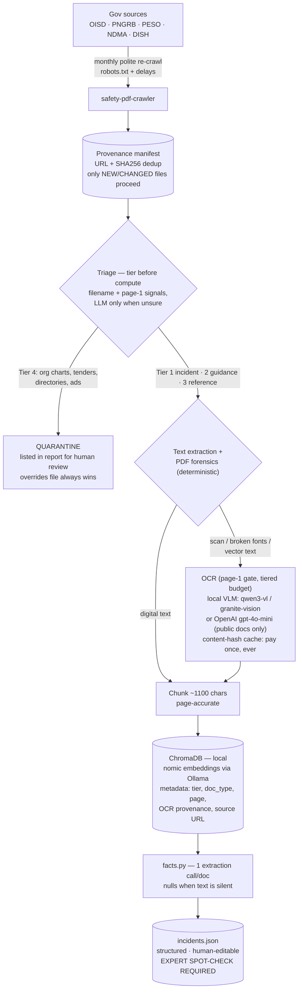
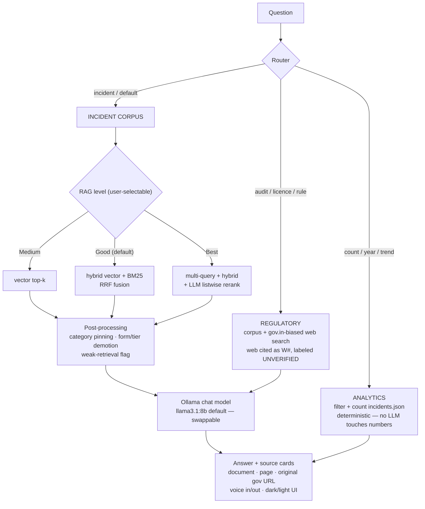
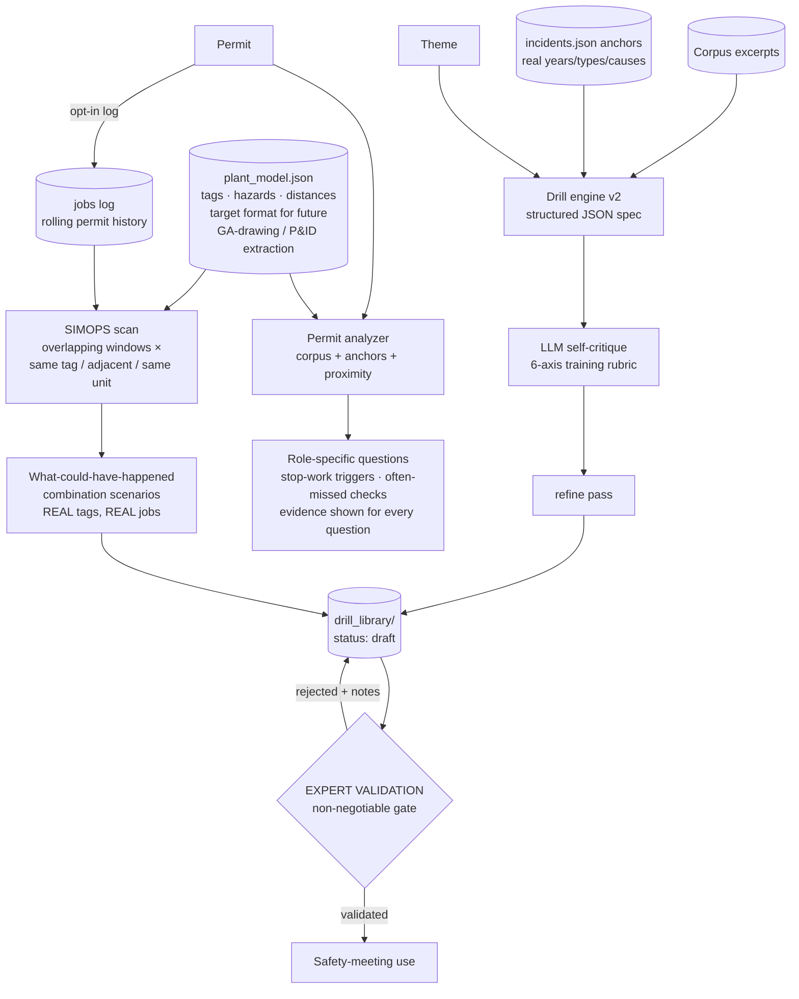

# IncidentWise

Local, fully on-prem RAG assistant over Indian process-safety documents
(OISD & PNGRB case studies, incident investigations, guidelines, DISH and
NDMA material). Ollama for generation and embeddings, ChromaDB for
retrieval, FastAPI + React UI. Every answer cites the exact source
document and page via a crawl provenance manifest.

**Status: research prototype.** Numbers from the eval harness are in
`incidentwise/evals/REPORT.md` — if that file is missing, the maintainers
haven't earned your trust yet.

## What's inside

| Folder | What it is |
|---|---|
| `safety-pdf-crawler/` | Polite crawler that rebuilds the public corpus with full provenance (robots.txt-aware) |
| `incidentwise/` | Ingestion (with optional VLM OCR), tiered retrieval (vector / hybrid+RRF / rerank), vertical routing with regulatory web fallback, incident-drill generator, React UI |
| `incidentwise/evals/` | Golden-set eval harness: retrieval hit-rate, router accuracy, refusal & grounding checks |

## Architecture

### 1 — Corpus lifecycle: from government portals to a clean, structured knowledge base

### 2 — Question lifecycle: every answer type has its own guarantees

### 3 — Generation side: drills, permits, and job-combination (SIMOPS) what-ifs

### Guardrail map — where each safeguard lives and what it protects

| Stage | Guardrail | Protects against |
|---|---|---|
| Crawl | robots.txt + delays + manifest provenance | legal exposure; unverifiable corpus |
| Triage | conservative quarantine — LLM alone can never condemn; human overrides file | losing one real incident report (costs more than indexing ten org charts) |
| Forensics | measured verdicts, not "scanned?" guesses | silent data loss from mislabeled PDFs |
| OCR | page-1 gate, tiered budgets, circuit breaker, content-hash cache | runaway compute/cost; repeated spend |
| Facts | extract-only-what's-stated, nulls, confidence, human-editable table | fabricated dates/casualties in analytics |
| Analytics | zero LLM in the counting path; coverage + date-source disclosure | hallucinated numbers with confident tone |
| Retrieval | weak-retrieval flag, form/tier demotion, category pinning | confidently answering from the wrong documents |
| Generation (chat) | context-only prompt, mandatory [n] citations, refuse when absent, never invent clause numbers | plausible-but-wrong safety advice |
| Regulatory web | UNVERIFIED labels, W# citations, "confirm on official page" closer | mistaking search snippets for law |
| Drills / SIMOPS | grounding numbers per mechanism, validation checklist, draft→expert-validated workflow | fiction masquerading as training truth |
| Permits | deterministic evidence returned beside every LLM output; issuer-responsibility disclaimer | automation complacency |
| Evals | golden set, refusal + grounding judges, publish gate | shipping unmeasured accuracy claims |

## Quickstart

Run it one of two ways:

- **Local, fully offline** — Ollama + two model pulls + `python ingest.py` + `uvicorn`. Full steps in `incidentwise/README.md`.
- **Free Colab GPU (shareable public link)** — one notebook cell restores state from your Google Drive, starts Ollama, and opens a `*.trycloudflare.com` URL for demos. Full steps in `COLAB_DEMO.md`.

1. Crawl (or bring your own PDFs): see `safety-pdf-crawler/`
2. Run the app — locally (`incidentwise/README.md`) or on a Colab GPU (`COLAB_DEMO.md`)
3. Run the evals: `python evals/run_evals.py` from `incidentwise/`

## Disclaimer — read this

This software provides **informational assistance only**. It is not a
substitute for the original standards, statutory requirements, a
competent safety professional, or your site's management-of-change and
permit-to-work systems. Generated drill scenarios are drafts that
**require validation by a qualified expert** before any use. Answers can
be wrong; citations exist precisely so you can check them. Do not make
safety-critical decisions on the basis of this tool's output.

The corpus PDFs are not redistributed in this repository; the crawler
fetches them from the original public government sources.

## License

Apache-2.0 — see [LICENSE](LICENSE).
